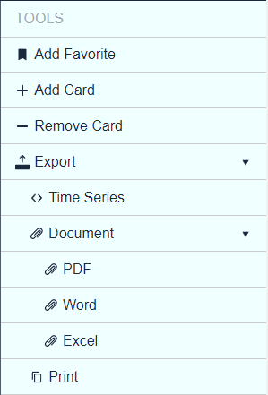

# Description
Tools menu service holds list of items that are displayed in the right-hand side menu in Poseidon. It is used by application developers in order to add custom commands in the tools menu. 

## Definitions
- **Tools menu:** The right-aligned sidebar in Poseidon, toggled by the following button  . It shows a list of items (buttons) provided by the Tools menu service.
- **Tools menu item:** Represents button in the Tools menu with label, associated action and possibly a list of child items that are displayed nested under the parent. 
- **Tools menu service:** Angular service provided by the platform so that applications can register Tools menu items. 


# Usage

## Contracts

### Tools menu service
```typescript
export class ToolsMenuService {
    items: ToolsMenuItem[];
    register(...items: ToolsMenuItem[]): void { ... }
    clear(): void { ... }
}
```

### Tools menu item
```typescript
export class ToolsMenuItem {
    label: string;
    icon: string;
    parent: ToolsMenuItem;
    children: ToolsMenuItem[];
    onSelected: () => void;

    addChildren(...items: ToolsMenuItem[]): void { ... }
    get depth(): number { ... }
}
```

## Injecting

The Tools menu service is standard Angular service provided by the platform and can be used by injecting it into your components.
```typescript
@Component( ... )
export class ToolsMenuTestPageComponent {
    constructor(private toolsMenuService: ToolsMenuService) { ... }

```

## Registering tools menu items

The register method accepts  one or more ```ToolsMenuItem``` objects and add them to the Tools menu.  
```typescript
register(...items: ToolsMenuItem[]): void
```

### Simple usage

The following code adds single item in the Tools menu with specified label and ```onSelected``` handler:
```typescript
ngOnInit(): void {
    const myToolsMenuItem = new ToolsMenuItem();
    myToolsMenuItem.label = 'Hello';
    myToolsMenuItem.onSelected = () => {
        console.log('Hello world!');
    };
    this.toolsMenuService.register(myToolsMenuItem);
}
```

### Multiple items

Multiple items can be registered in the following way:
```typescript
ngOnInit(): void {
    const item1 = new ToolsMenuItem();
    item1.label = 'Item 1';
    item1.onSelected = () => {
        console.log('Item 1 clicked');
    };
    const item2 = new ToolsMenuItem();
    item2.label = 'Item 2';
    item2.onSelected = () => {
        console.log('Item 2 clicked');
    };
    this.toolsMenuService.register(item1, item2);
}
```

### With icons

Each menu item can have icon displayed before its label. The icon is specified by its name. The available icons are provided by Design System as "sprites".
```typescript
ngOnInit(): void {
    const addItem = new ToolsMenuItem();
    addItem.label = 'Add';
    addItem.icon = 'plus';
    addItem.onSelected = () => {
        console.log('Add clicked');
    };
    const removeItem = new ToolsMenuItem();
    removeItem.label = 'Remove';
    removeItem.icon = 'minus';
    removeItem.onSelected = () => {
        console.log('Remove clicked');
    };
    this.toolsMenuService.register(addItem, removeItem);
}
```

### Hierarchical menu

Tools menu items can have children (sub-items); they are displayed below their parent and initially are hidden (collapsed). Parent items have "expand" icon to indicate that nested items are available. When you click a parent item, it shows its children list. Multiple nesting levels (children with grandchildren, etc.) are supported.
```typescript
ngOnInit(): void {
    const item1 = new ToolsMenuItem();
    item1.label = 'Item 1';
    myToolsMenuItem.onSelected = () => {
        console.log('Item 1 clicked');
    };
    const item2 = new ToolsMenuItem();
    item2.label = 'Item 2';
    const item21 = new ToolsMenuItem();
    item21.label = 'Item 2.1';
    item21.onSelected = () => {
        console.log('Item 2.1 clicked');
    };
    const item22 = new ToolsMenuItem();
    item22.label = 'Item 2.2';
    item22.onSelected = () => {
        console.log('Item 2.2 clicked');
    };
    item2.addChildren(item21, item22);
    this.toolsMenuService.register(item1, item2);
}
```

## Getting the registered tools menu items

The Tools menu service provides array of already registered items; they can be managed (added, edited, or removed) at any time by the application that uses the service. 
```typescript
const toolsMenuItems: ToolsMenuItem[] = this.toolsMenuService.items;
toolsMenuItems[0].label = 'New label';
```

## Clearing the Tools menu

Applications are responsible to clear the Tools menu when the user navigates away. As a general rule, every component adds Tools menu items during initialization and clears the Tools menu on exit. Use the following code to achieve that: 
```typescript
ngOnDestroy(): void {
    this.toolsMenuService.clear();
}
```


# Comprehensive example

The following is a sample component that demonstrates the features of the tools menu service:
```typescript
export class ToolsMenuTestPageComponent implements OnInit, OnDestroy {
    constructor(
        private toolsMenuService: ToolsMenuService,
    ) { }

    ngOnInit(): void {
        this.initToolsMenuItems();
    }

    private initToolsMenuItems() {
        const toggleFavoriteItem = new ToolsMenuItem();
        toggleFavoriteItem.label = 'Add Favorite';
        toggleFavoriteItem.icon = 'bookmark';
        toggleFavoriteItem.onSelected = () => this.toggleFavorite();
		
        const addCardItem = new ToolsMenuItem();
        addCardItem.label = 'Add Card';
        addCardItem.icon = 'plus';
        addCardItem.onSelected = () => this.addCard();
		
        const removeCardItem = new ToolsMenuItem();
        removeCardItem.label = 'Remove Card';
        removeCardItem.icon = 'minus';
        removeCardItem.onSelected = () => this.removeCard();
		
        const exportItem = new ToolsMenuItem();
        exportItem.label = 'Export';
        exportItem.icon = 'pull-up';
        
	const exportTimeSeriesItem = new ToolsMenuItem();
        exportTimeSeriesItem.label = 'Time Series';
        exportTimeSeriesItem.icon = 'angle-swap-horizontal';
        exportTimeSeriesItem.onSelected = () => this.exportTimeSeries();
        
	const exportDocumentItem = new ToolsMenuItem();
        exportDocumentItem.label = 'Document';
        exportDocumentItem.icon = 'attachment';
        
	const exportPdfItem = new ToolsMenuItem();
        exportPdfItem.label = 'PDF';
        exportPdfItem.icon = 'attachment';
        exportPdfItem.onSelected = () => this.exportPdf();
        
	const exportWordItem = new ToolsMenuItem();
        exportWordItem.label = 'Word';
        exportWordItem.icon = 'attachment';
        exportWordItem.onSelected = () => this.exportWord();
        
	const exportExcelItem = new ToolsMenuItem();
        exportExcelItem.label = 'Excel';
        exportExcelItem.icon = 'attachment';
        exportExcelItem.onSelected = () => this.exportExcel();
        
	exportDocumentItem.addChildren(exportPdfItem, exportWordItem, exportExcelItem);
        
	const printItem = new ToolsMenuItem();
        printItem.label = 'Print';
        printItem.icon = 'papers';
        printItem.onSelected = () => this.print();
        
	exportItem.addChildren(exportTimeSeriesItem, exportDocumentItem, printItem);
        
	this.toolsMenuService.register(toggleFavoriteItem, addCardItem, removeCardItem, exportItem);
    }

    ngOnDestroy(): void {
        this.toolsMenuService.clear();
    }

    private toggleFavorite(): void {
        const toggleFavoriteItem: ToolsMenuItem = this.toolsMenuService.items[0];
        if (toggleFavoriteItem.label === 'Add Favorite') {
            toggleFavoriteItem.label = 'Remove Favorite';
            toggleFavoriteItem.icon = 'close';
        } else {
            toggleFavoriteItem.label = 'Add Favorite';
            toggleFavoriteItem.icon = 'bookmark';
        }
    }

    private  addCard(): void { console.log('Add card clicked'); }

    private  removeCard(): void { console.log('Add card clicked'); }

    private  exportTimeSeries(): void { console.log('Export Time Series clicked'); }

    private  exportPdf(): void { console.log('Export PDF clicked'); }

    private  exportWord(): void { console.log('Export Word clicked'); }

    private  exportExcel(): void { console.log('Export Excel clicked'); }

    private  print(): void { console.log('Print clicked'); }
}
```
The example will create the following tools menu: 


